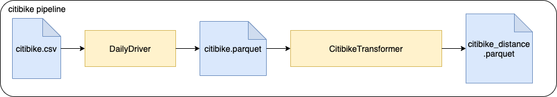

# Data transformations with Scala

This is a collection of jobs that are supposed to transform data.
These jobs are using _Spark_ to process larger volumes of data and are supposed to run on a _Spark_ cluster (
via `spark-submit`).

## Preparing for the interview

> [!WARNING]
> The exercises will be given at the time of interview, and **solved by pairing with the interviewer**.  
> Please do not solve the exercises before the interview.

**✅ Goals:**

1. **Get a [working environment set up](#setup-the-environment).** You can setup a [local environment](#option-1-local-setup), use a [github codespaces](#option-2-devcontainer-setup---github-codespaces) or use [other alternative](#option-3-in-vscode---alternative).
2. 2. **Get a high-level understanding of the code and test dataset structure**
3. Have your preferred text editor or IDE setup and ready to go.
4. ⚠️ Don't solve the exercises before the interview. ⚠️

## Setup the environment

### Option 1: Local Setup

> [!TIP]
> Use the [Devcontainer setup](#option-2-devcontainer-setup---github-codespaces) if you encounter issues.

#### Pre-requisites

Please make sure you have the following installed and can run them

- Java 17
- Scala 2.13.17
- Sbt 1.11.6
- Apache Spark 4.0 with ability to run spark-submit

#### Windows users

We recommend using WSL 2 on Windows for this exercise, due to the [lack of support](https://cwiki.apache.org/confluence/display/HADOOP2/WindowsProblems) of windows paths from Hadoop/Spark.

Follow instructions on the [Windows official page](https://learn.microsoft.com/en-us/windows/wsl/setup/environment) and then the linux install.  
Use the [Devcontainer setup](#option-2-devcontainer-setup) if you encounter issues.

#### Local Setup Process

- Clone the repo
- Package the project with `sbt package`
- Ensure that you're able to run the tests with `sbt test` (some are ignored)
- Sample data is available in the `src/test/resource/data` directory

### Option 2: Devcontainer setup - Github codespaces

Configuration to use dev containers is provided in `.devcontainer`

> [!WARNING]
> This takes up to 7 minutes to setup, make sure to have things running before the interview.

1. [Fork](https://github.com/techops-recsys-lateral-hiring/dataengineer-transformations-scala/fork) this repository.
2. Follow [codespace instructions](https://docs.github.com/en/codespaces/developing-in-a-codespace/creating-a-codespace-for-a-repository#the-codespace-creation-process) from the forked repository, to create the environment.

#### Option 3: In VSCode - Alternative

This requires a working local docker setup matching your OS and licensing situation, and [VSCode](https://code.visualstudio.com/download).

If you have all of these, follow instructions in https://code.visualstudio.com/docs/devcontainers/containers. Otherwise, consider using codespaces.

### Verify setup

> All of the following commands should be running successfully

#### Run all tests

```bash
sbt test
```

#### Run specific tests class

```bash
sbt "test:testOnly *MySuite"
```

#### Run style checks

```bash
sbt scalastyle
```

### Done!

All commands are passing?  
You are good to go!

> [!WARNING]
> Remember, do not try to solve the exercises ahead of the interview.

> [!TIP]
> You are allowed to customize your environment (having the test in vscode directly for example): feel free to spend the time making this comfortable for you. This is not an expectation.

## Jobs

There are two applications in this repo: Word Count, and Citibike.

Currently these exist as skeletons, and have some initial test cases which are defined but ignored. For each
application, please un-ignore the tests and implement the missing logic.

## Wordcount

A NLP model is dependent on a specific input file. This job is supposed to preprocess a given text file to produce this
input file for the NLP model (feature engineering). This job will count the occurrences of a word within the given text
file (corpus).

There is a dump of the data lake for this under `test/resources/data/words.txt` with a text file.

#### Input

Simple `*.txt` file containing text.

#### Output

A single `*.csv` file containing data similar to:

```csv
"word","count"
"a","3"
"an","5"
...
```

#### Run the job

```bash
 spark-submit --master local --class thoughtworks.wordcount.WordCount \
    target/scala-2.12/tw-pipeline_2.12-0.1.0-SNAPSHOT.jar \
    "./src/main/resources/data/words.txt" \
    ./output
```

### Citibike

For analytics purposes the BI department of a bike share company would like to present dashboards, displaying the
distance each bike was driven. There is a `*.csv` file that contains historical data of previous bike rides. This input
file needs to be processed in multiple steps. There is a pipeline running these jobs.



There is a dump of the datalake for this under `/src/test/resources/data/citibike.csv` with historical data.

#### Ingest

Reads a `*.csv` file and transforms it to parquet format. The column names will be sanitized (whitespaces replaced).

##### Input

Historical bike ride `*.csv` file:

```csv
"tripduration","starttime","stoptime","start station id","start station name","start station latitude",...
364,"2017-07-01 00:00:00","2017-07-01 00:06:05",539,"Metropolitan Ave & Bedford Ave",40.71534825,...
...
```

##### Output

`*.parquet` files containing the same content

```csv
"tripduration","starttime","stoptime","start_station_id","start_station_name","start_station_latitude",...
364,"2017-07-01 00:00:00","2017-07-01 00:06:05",539,"Metropolitan Ave & Bedford Ave",40.71534825,...
...
```

##### Run the job

```bash
spark-submit --master local --class thoughtworks.ingest.DailyDriver \
    target/scala-2.12/tw-pipeline_2.12-0.1.0-SNAPSHOT.jar \
    "./src/main/resources/data/citibike.csv" \
    "./output_int"
```

#### Distance calculation

This job takes bike trip information and calculates the "as the crow flies" distance traveled for each trip. It reads
the previously ingested data parquet files.

> [!TIP]
> For distance calculation, consider using [**Haversine formula**](https://www.movable-type.co.uk/scripts/latlong.html) as an option.

##### Input

Historical bike ride `*.parquet` files

```csv
"tripduration",...
364,...
...
```

##### Outputs

`*.parquet` files containing historical data with distance column containing the calculated distance.

```csv
"tripduration",...,"distance"
364,...,1.34
...
```

##### Run the job

```bash
 spark-submit --master local --class thoughtworks.citibike.CitibikeTransformer \
    target/scala-2.12/tw-pipeline_2.12-0.1.0-SNAPSHOT.jar \
    "./output_int" \
    ./output
```

> [!WARNING]
> One last time: do not try to solve the exercises ahead of the interview. 😅
